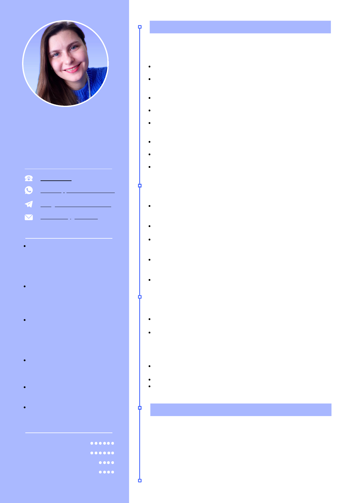

<!DOCTYPE html>

<html xmlns="http://www.w3.org/1999/xhtml">
<head>
<meta charset="utf-8"/>

<meta http-equiv="X-UA-Compatible" content="IE=edge,chrome=1"/>
<link rel="stylesheet" href="base.min.css"/>
<link rel="stylesheet" href="fancy.min.css"/>
<link rel="stylesheet" href="main.css"/>

<title></title>
</head>
<body>

C O N T A C T O

H A B I L I D A D E S

Ucraniano - nativo

Español - intermedio

Ruso - nativo

I D I O M A S

E X P E R I E N C I A   L A B O R A L

F O R M A C I Ó N

Universidad Nacional Lingüística de Kyiv (09.2003 - 02.2007)

Licenciatura en Filología Inglesa

MEGAMARKET (06.2017 - 02.2022) 

Administradora de sitios web, gestora de contenido, SMM

Participación  en  la  creación  y  soporte  de  tiendas  en  línea  y

aplicaciones móviles.

Elaboración  de  planes  de  contenido,  escritura  de  textos  únicos,

desarrollo  de  contenido  gráfico  en  Adobe  Photoshop  para  sitios  y

redes sociales.

Creación  y  edición  de  fichas  de  productos,  y  publicación  otros

contenidos en tiendas en línea con CMS Simpla.

Supervisión  del  correcto  funcionamiento  de  las  tiendas  en  línea  y

corrección de errores básicos de manera autónoma.

Publicación  de  contenido,  configuración  de  la  publicidad  dirigida  y

generación  seguidores  en  las  redes  sociales,  como  Facebook  e

Instagram.

Creación  y  envío  de  contenido  HTML  para  campañas  de  correo

electrónico.

Comunicación con los clientes y soporte técnico a usuarios y recursos

web.

Analítica  de  las  páginas  web  para  determinar  el tráfico  de  los  sitios  y

los niveles de participación del contenido.

MANUFACTURA (09.2016 - 05.2017) 

Gestora de contenidos, SMM

Elaboración  planes  de  contenido,  creación  textos  únicos  y  contenido

gráfico  para  el  sitio  y  las  redes  sociales.  También  traducción  textos

(inglés, ucraniano, ruso).

Colocación de contenido en las redes sociales y en el sitio web con un

CMS personalizado.

Supervisión  del  correcto  funcionamiento  del  sitio  web  y  corrección

errores  básicos  de  manera  autónoma,  además  de  abordar  errores  más

complejos con la ayuda de programadores.

Publicación  de  contenido,  configuración  de  publicidad  dirigida  y

generación  seguidores  en  las  redes  sociales,  como  Facebook  e

Instagram.

Análisis  de  las  páginas  web  para  determinar  el  tráfico  del  sitio  y  los

niveles de participación del contenido.

UAWEB (07.2015 - 07.2016) 

Redactora, gestora de contenidos

Redacción,  reescritura,  corrección  y  traducción  de  textos  (inglés,

ucraniano, ruso). 

Generación  de  textos  SEO,  textos  de  relaciones  públicas,  textos  para

redes  sociales  (SMM),  textos  publicitarios  y  de  ventas  (AIDA,  FAB,

PAS,  PMHS,  etc.),  así  como  artículos  informativos  para  sitios  web,

publicaciones  en  línea  y  blogs.  También  creación  de  eslóganes,

titulares y nombres.

Trabajo  con  recursos  como  Text.ru  y  Advego.ru,  así  como  con

programas como Advego Plagiatus y Etxt Antiplagiat.

Desarrollo contenido gráfico utilizando Adobe Photoshop.

Colocación  de  contenido  en  varios  recursos  web  con  diferentes  CMS

(WordPress, MODX, Opencart).

OLENA

SHCHERBAKOVA

Academia de marketing en Internet WebPromoExperts

(05 - 07.2021)

Especialista en SEO

643955982

WhatsApp +380934229377

Telegram +380934229377

alena09tv@gmail.com

Inglés - intermedio

Usuario avanzado de sistemas

operativos Windows, Linux,

macOS, así como,  programas

ofimáticos (Word, Excel,

PowerPoint etc).

Trabajo con Adobe Photoshop,

Adobe Acrobat Reader DC,

GIMP, Text.ru, Advego Plagiatus,

Etxt Antiplagiat, etc.

Usuario nivel avanzado de

herramientas de Google como

Google Search Console, Google

Analytics, Google Keyword

Planner, etc.

Experiencia con CMS como

WordPress, Joomla, MODX,

Opencart, Simpla, entre otros.

Experiencia con lenguajes HTML

y CSS, JavaScript - básico.

Sublime Text, Notepad++, cliente

FTP FileZilla, MySQL, cPanel.

<a class="l" href="tel:643955982">

</a><a class="l" href="https://wa.me/380934229377">

</a><a class="l" href="https://t.me/380934229377">

</a><a class="l" href="mailto:alena09tv@gmail.com">

</a>

</body>
</html>
